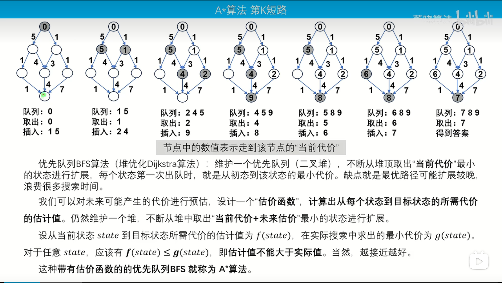
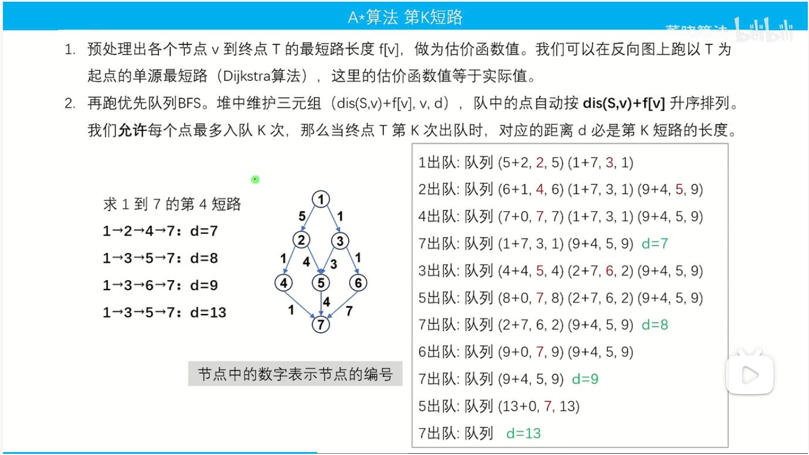
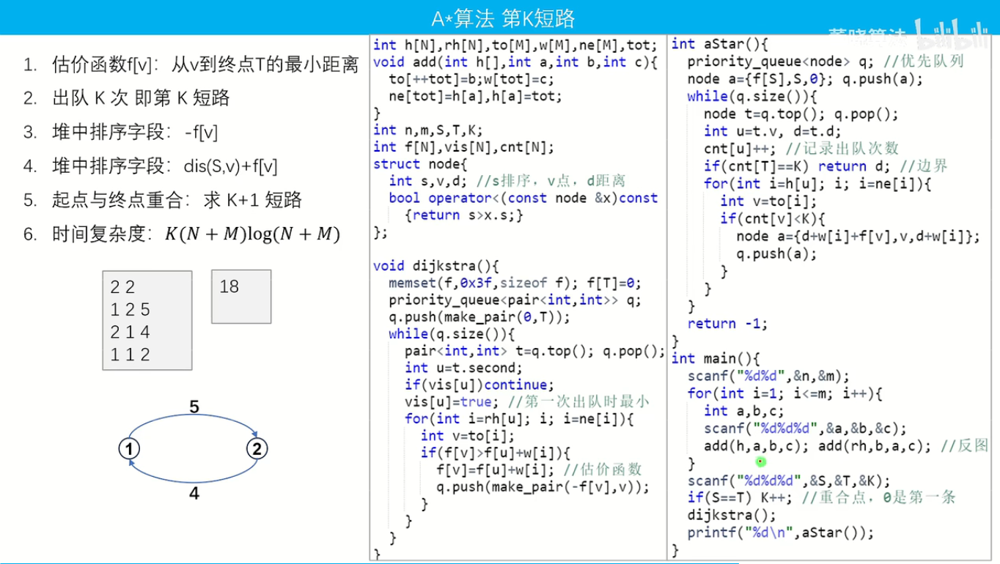

# **A*算法**
## 问题:  

> 基于Dijkstra算法,求第K短路问题.  


### 关于A*算法
> - ## **什么是A*算法**
> 
> - ## **具体**  
> ### &emsp;&emsp;优先队列BFS算法(堆优化Dikstra算法):维护一个优先队列 (二叉堆)不断从堆顶取出“当前代价”最小的状态进行扩展，每个状态第一次出队时，就是从初态到该状态的最小代价。缺点就是最优路径可能扩展较晚浪费很多搜索时间。
> ### &emsp;&emsp;我们可以对未来可能产生的代价进行预估，设计一个“估价函数”，计算出从每个状态到目标状态的所需代价的估计值。仍然维护一个堆，不断从堆中取出“当前代价+未来估价"最小的状态进行扩展。  
> ### &emsp;&emsp;设从当前状态 state 到目标状态所需代价的估计值为 f(state)，在实际搜索中求出的最小代价为 g(state)对于任意 state，应该有 f(state) < g(state)，即估计值不能大于实际值。当然，越接近越好。  
> ### &emsp;&emsp;这种带有估价函数的的优先队列BFS 就称为A算法。  
>  ---
## 题目  
- [Remmarguts' Date(POJ)](http://poj.org/problem?id=2449)


### 如何实现？
  





```C++
// #include<bits/stdc++.h>
#include<cstdio>
#include<iostream>
#include<queue>
#include<algorithm>
#include<cstring>


using namespace std;
const int N = 1010,M = 2e5 + 10;
int n,m;
int S,T,K;
int ans;
struct whp{
    int s,v,d;// v 点 ，d 距离
    bool operator < (const whp P)const{
        return s > P.s;
    }
};
int h[N],hr[N],e[M],ne[M],w[M],cnt;
void add(int hh[],int a,int b,int c){
    e[cnt] = b,w[cnt] = c,ne[cnt] = hh[a],hh[a] = cnt++;
}
int f[N],vis[N],tot[N];
void dijkstra(){
    memset(f,0x3f,sizeof f);
    f[T] = 0;
    priority_queue<pair<int,int> >q;
    q.push({0,T});
    while(q.size()){
        //auto [sz,id] = q.top();q.pop();
        pair<int,int> t= q.top();q.pop();
        int sz = t.first,id = t.second;
        if(vis[id])continue;vis[id] = 1;
        for(int i = hr[id];~i;i = ne[i]){
            int j = e[i];
            if(f[j] > f[id] + w[i]){
                f[j] = f[id] + w[i];//gu jia han shu反向距离
                q.push({-f[j],j});
            }
        }
    }
}

int astart(){
    priority_queue<whp>q;
    whp a = {f[S],S,0};
    q.push(a);
    while(q.size()){
        //auto [s,u,d] = q.top();q.pop();
        whp t= q.top();q.pop();
        int s = t.s,u = t.v,d = t.d;
        tot[u]++;
        if(tot[T] == K)return d;
        for(int i = h[u];~i;i = ne[i]){
            int j = e[i];
            if(tot[j] < K){
                whp a = {f[j] + d + w[i],j,d + w[i]};
                q.push(a);
            }
        }
    }
    return -1;
}

int main(){
    memset(h,-1,sizeof h);
    memset(hr,-1,sizeof hr);
    scanf("%d%d",&n,&m);
    for(int i = 1; i <= m;i++){
        int a,b,c;
        scanf("%d%d%d",&a,&b,&c);
        add(h,a,b,c);add(hr,b,a,c);
    }
    scanf("%d%d%d",&S,&T,&K);
    if(S == T)K++;
    dijkstra();
    printf("%d",astart());
    return 0;
}


```


